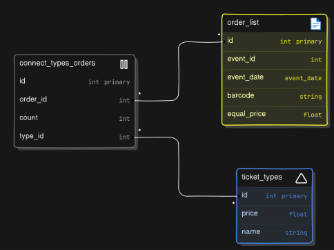
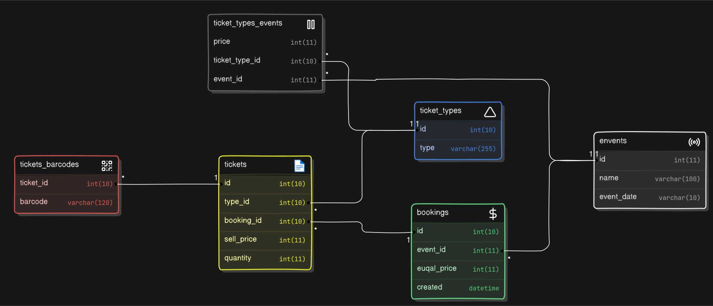

## How to run

```bash
git clone git@https://github.com/Shadovitsme/nevatrip

cd Laboratory_Internet
cp .env.example .env
composer update
php artisan key:generate
vendor/bin/sail artisan migrate:fresh
npm install
npm run build
docker compose up
```

Открыть в браузере `http://localhost:80/`


> Вместо клонирования репозитория можно скачать один из релизов.


## Пояснения по заданиям
В примере в задании 1 varchar(10) для хранения даты слишком короткий использовала более длинный.
### Задание 1

Изначальная структура БД соответствует таковому в задании.

### Задание 2.1
Для выполнения задания БД менялась

Типы билетов и их стоимость вынесены в отдельную таблицу, факт заказа определенного типа билетов устанавливается через дополнительную таблицу.



Корректировки структуры БД производились дополнительными миграциями, а не исправлением существующих.

### Задание 2.2
В соответствии с заданием, БД подверглась значительной переделке.

* Теперь у каждого события свои типы билетов со своей стоимостью.
* Как заказ в целом, так и указанные в нем билеты дополнительно сохраняют цену по которой они были проданы. Это сделано на случай если стоимость билетов изменится и потребуется получить исторические данные или собрать статистику, а также для упрощения и ускорения выборок.
* Баркоды хранятся отдельно без доп. данных, так как у них нет привязки к человеку/месту, так что они практически взаимозаменяймы в рамках типа билетов одного заказа.



Так как изменения принципа работы стороннего API не было, как и объяснения как реагировать на различные ошибки, заказ целиком будет отклонён даже если проверку "/approve" не прошел только один из баркодов. Причины отдельных отказов, на что они распространяются и как на них реагировать - не объяснены в задании - имеет место вольность интерпретации с моей стороны.

## Документация по коду

[Индексная страница](/resources/views/buttonPlaceholder.blade.php) выдаётся через [роутер](/routes/web.php). Там же обрабатываются запросы к API, так как там подключен [контроллер](/app/Http/Controllers/TicketController.php). Ниже приведено объяснение функций контроллера.

#### chooseAction(Request $req): Response
Входная точка - начало заказа. Отдаёт запрос на формирование баркодов, проверяет баркоды у стороннего api "/approve".

#### orderTickets(array $arJsonTickets): null|array
Обрабатывает каждый тип заказываемого билета: формирует уникальные баркоды, проверяет их у внешнего api "/book".

#### findBarcodeIbTable($barcode): bool
Проверяет баркод на уникальность (запрос к БД).

#### generateBarcode(): string
Создаёт баркод стандарта EAN-8.

#### addOrderToDatabase($event_id, $arTickets, $barcodes): bool
Добавляет в БД все необходимые данные.

#### book($event_id = null, $event_date = null, $ticket_adult_price = null, $ticket_adult_quantity = null, $ticket_kid_price = null, $ticket_kid_quantity = null, $barcode = null): Response
Мокап стороннего api. Возвращает с вероятностью 50% ошибку о неуникальности баркода

#### approve($barcode = null): Response
Мокап стороннего api. Возвращает с веротяностью 10% одну из ошибок с равной вероятностью.
